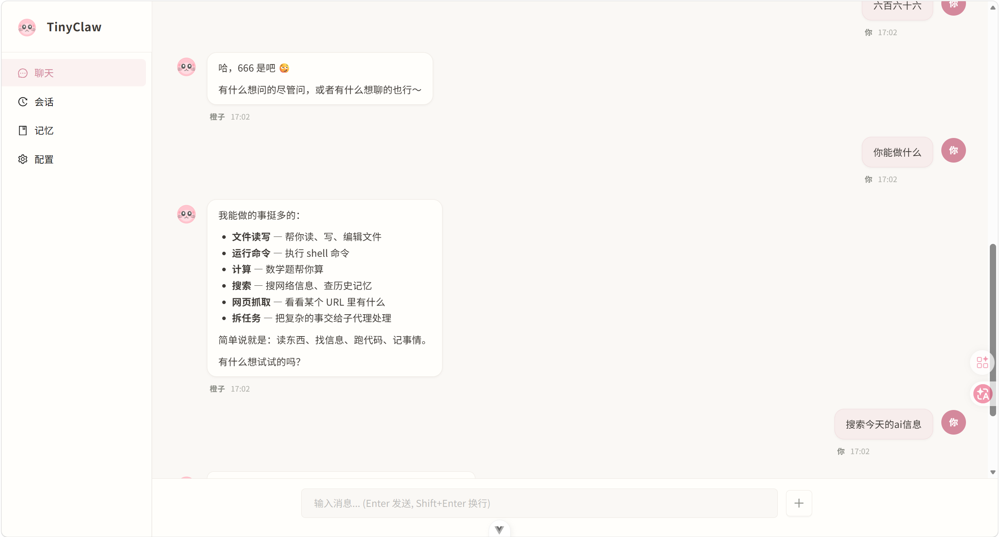

# TinyClaw



**TinyClaw** 是一个基于 Hello-Agents 框架的个性化 AI Agent，支持流式对话、工具调用、记忆管理和多会话。

## 功能特性

- **流式对话** - 基于 SSE 的实时流式响应
- **工具调用** - 内置文件读写、命令执行、网页搜索、计算器等工具
- **记忆系统** - 长期记忆 + 每日记忆自动管理
- **多会话支持** - 会话历史持久化，可随时切换
- **身份定制** - 通过配置文件自定义 Agent 名称、个性、风格
- **现代化前端** - Vue 3 + Ant Design Vue 构建的 Web 界面

## 技术栈

| 层级 | 技术 |
|------|------|
| 后端 | Python 3.10+ / FastAPI / SSE |
| Agent 框架 | Hello-Agents (SimpleAgent) |
| Python 包管理 | uv |
| 前端 | Vue 3 + TypeScript + Vite |
| UI 组件 | Ant Design Vue |

## 项目结构

```
TinyClaw/
├── backend/                  # Python FastAPI 后端
│   ├── src/
│   │   ├── agent/           # Agent 核心
│   │   ├── api/             # REST API 路由
│   │   ├── channels/        # CLI 渠道
│   │   ├── cli/             # 命令行工具
│   │   ├── memory/          # 记忆管理
│   │   ├── tools/builtin/   # 内置工具集
│   │   └── workspace/        # 工作空间管理器
│   ├── .env.example
│   └── pyproject.toml
├── frontend/                 # Vue 3 前端
│   ├── src/
│   │   ├── views/           # 页面组件
│   │   ├── components/      # 通用组件
│   │   ├── api/             # API 请求
│   │   └── assets/          # 静态资源
│   ├── .env.example
│   └── package.json
└── LICENSE
```

## 快速开始

### 前置要求

- Python 3.10+
- Node.js 18+
- [uv](https://astral.sh/uv/) (Python 包管理器)
- [pnpm](https://pnpm.io/) (前端包管理器)

### 1. 克隆项目

```bash
git clone https://github.com/BennJay44/TinyClaw.git
cd TinyClaw
```

### 2. 配置后端

```bash
cd backend
cp .env.example .env
# 编辑 .env 填入你的 LLM API Key
```

`.env` 关键配置项：

```env
LLM_MODEL_ID=your-model-id        # 例：MiniMax-M2.7, glm-4
LLM_API_KEY=your-api-key          # 你的 API Key
LLM_BASE_URL=https://api.example.com/v1  # LLM API 地址
PORT=8000
CORS_ORIGINS=http://localhost:5173
WORKSPACE_PATH=~/.tinyclaw/workspace
```

### 3. 启动后端

```bash
uv sync
uv run python -m uvicorn src.main:app --reload --port 8000
```

### 4. 启动前端

```bash
cd frontend
pnpm install
pnpm dev
```

访问 **http://localhost:5173** 即可使用。

## 配置说明

### LLM 配置

TinyClaw 支持任何 OpenAI 兼容 API，只需修改 `.env`：

```env
# MiniMax 示例
LLM_MODEL_ID=MiniMax-M2.7
LLM_API_KEY=sk-xxxxx
LLM_BASE_URL=https://api.minimaxi.com/v1

# 智谱 AI 示例
LLM_MODEL_ID=glm-4
LLM_API_KEY=xxxxx
LLM_BASE_URL=https://open.bigmodel.cn/api/paas/v4/

# OpenAI 示例
LLM_MODEL_ID=gpt-4
LLM_API_KEY=sk-xxxxx
LLM_BASE_URL=https://api.openai.com/v1
```

### 工作空间

Agent 的配置文件位于 `~/.tinyclaw/workspace/`：

| 文件 | 用途 |
|------|------|
| `IDENTITY.md` | Agent 身份（名称、风格、emoji 头像） |
| `USER.md` | 用户信息（名字、时区、偏好） |
| `MEMORY.md` | 长期记忆（Agent 主动写入） |
| `SOUL.md` | 个性模板 |
| `AGENTS.md` | Agent 工作指南 |
| `memory/` | 每日记忆文件夹 |
| `sessions/` | 会话历史 JSON 文件 |

### 内置工具

| 工具 | 功能 |
|------|------|
| `Read` | 读取文件或目录列表 |
| `Write` | 写入/创建文件 |
| `Edit` | 精确替换文件内容 |
| `python_calculator` | 数学计算 |
| `memory_*` | 记忆搜索/读取/添加 |
| `exec_run` | 执行白名单内的 shell 命令 |
| `search_web` | Brave Search 网页搜索 |
| `fetch_url` | 抓取网页内容 |

## API 接口

| 端点 | 方法 | 描述 |
|------|------|------|
| `/health` | GET | 服务健康检查 |
| `/api/chat/send/stream` | POST | SSE 流式聊天 |
| `/api/session/list` | GET | 获取会话列表 |
| `/api/session/create` | POST | 创建新会话 |
| `/api/session/{id}` | GET | 获取会话历史 |
| `/api/session/{id}` | DELETE | 删除会话 |
| `/api/config/agent/info` | GET | 获取 Agent 信息 |
| `/api/config/llm` | GET/PUT | LLM 配置读写 |
| `/api/memory/files` | GET | 列出记忆文件 |
| `/api/memory/content` | GET | 读取记忆内容 |

## 开发

### 命令行工具

```bash
cd backend
uv run python -m src.cli.main --help
```

